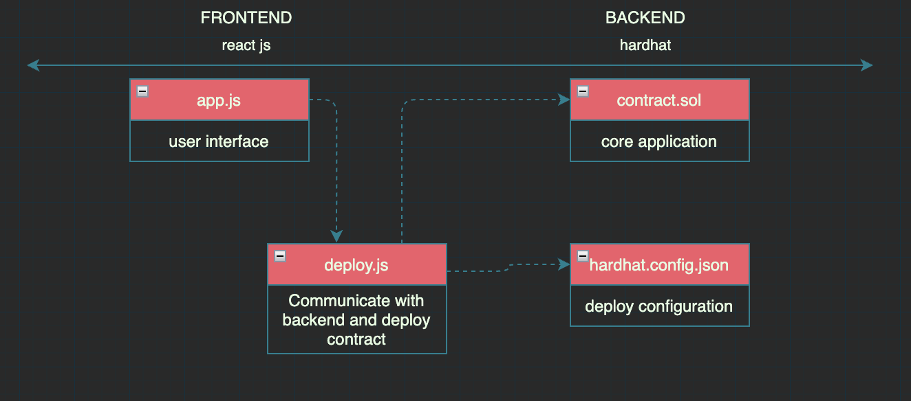

# Hello World DAPP

HWdapp is a hello world decentralized application. Contains the basic functionality so you can use it as a template and start building your own application.

Think of it as a hello world dapp starter kit.

## Table of contents
  * [what the dapp does?](#what-the-dapp-does-)
  * [Architecture diagram](#architecture-diagram)
  * [Technologies stack](#technologies-stack)
  * [what you will need](#what-you-will-need)
  * [Installation](#installation)
  * [Usage](#usage)
  * [Disclaimer](#disclaimer)
  * [FAQ](#faq)
  * [Other helpful resources](#other-helpful-resources)
  * [License](#license)

## what the dapp does?


- show text stored in the blockchain, and update that text. interact directly with ethereum blockchain!! (a testnet).

- feel free to udpdate the text of my contract through ehterscan.io at RINKEBY -> 0x4E98dfb698055717c013C42e2F84989e9bC9631a

- after making the transaction to update the text, please wait around 20 seconds there, until the transaction is confirmed, the app will automatically detect the change and update the text.

## Basic architecture diagram


## technologies stack
> - react js - build front end, animations, make your app look cute
> - vite - live server to deploy your dapp locally
> - ethers - Communicate with the blockchain and bridge to frontend
> - hardhat - compile, test and create a local blockchain




## what you will need

1. npm
2. an alchemy.com account -> [https://www.alchemy.com](url)
3. metamask account -> [https://metamask.io](url)
4. fake ether from the testnet you want to use  -> [https://faucet.rinkeby.io](url)

## Installation

1. Clone repository
```bash
git clone https://github.com/msucedo/HWdapp.git
``` 

2. install dependencies
```bash
cd HWdapp
npm install
```
The package.json should download all needed dependencies.

3. Install hardhat
```bash
cd HWdapp/contracts
npm install
``` 

## Usage

- to compile

```bash
cd HWdapp/contracts
npx hardhat compile
```

- to test on a local network (live only during execution)
```bash
cd HWdapp/contracts
npx hardhat run scripts/run.js
```

- to test on a local network (live undefined) with access to 20 accounts, with 1000eth, 0 blocks mined. note: two open terminal windows needed.
###### 	Terminal window 1
```bash
cd HWdapp/contracts
npx hardhat node
```
###### Terminal window 2
```bash
cd HWdapp/contracts
npx hardhat run scripts/deploy.js --network localhost
```	

- to test on a testnet (i.e. rinkeby)
1. edit "HWdapp/contracts/secret.json"
2. add your alchemy.com api url and your metamask account private key
3. edit "HWdapp/contracts/hardhat.config.js"
4. remove last comment to enable "networks" settings to work
3. run
```bash
cd HWdapp/contracts
npx hardhat run scripts/deploy.js --network rinkeby
```	
###### note: copy the contract address from your terminal window, open etherscan.io for the rinkeby network at search for this address. you should be able to see your contract.

- give your contract a front end!
```bash
cd HWapp/src/App.jsx
```
2. look for this property "contractAddress" and update it with your contract address
3. run
```bash
cd HWdapp
npm run dev
```
that will run vite and our app will be live! at `http://localhost:3000/`

## Disclaimer
you might find bugs, but for the simplicity and goal of the exercise they don't represent a risk, take this code as what it is (a path to the needed tools, folders, configurations to build, test and deploy locally a dapp).

Please note the goal of this repository is to give a clearer path of (one in between many choices you have on) how to locally build dapps, I found myself having trouble to understand how to develop locally and now that I have a kinda better idea I wanted to share with anyone interested the tools that I used and make available this simple template.

- note1: these are not the only tools available to build and deploy dapps.
- note2: I used solidity 0.8.4
- note3: regarding the alchemy.com account, it is free, from there we just need to create an app and copy the application key
- note4: I did not talk about some steps as they are easily self explanatory (funding your metamask with fake ether, create an alchemy account, etc)
- note5: any questions, comments, suggestions feel free to ping me at discord @msaucedo#2231


## FAQ

- I'm having issues compiling and running the project, what should I do?
> go to the terminal, write down the error and try googling it, if no luck ping me @msaucedo#2231 at discord.

- What is that run.js and deploy.js files for?
> After building your smart contract, you will need to test it. Even tho testing on a testnet is way more fun, sometimes we need to test locally.
> - run.js will deploy your contract in a local blockchain live only during code execution
> - deploy.js will depoy your contract in a local blockchain, live undefined (till your shut it down) this is done with hardhat, something cool with this method is that you will have 20 Etherium addreses, 1000eth, and a 0 mined blocks blockchain.


## Other helpful resources
- [buildsapce.so](https://buildspace.so) - this is where this repo comes from!
- [eth.build](https://eth.build)
- [scaffold-eth](https://github.com/scaffold-eth/scaffold-eth)
- [cryptozombies](https://cryptozombies.io)

## License
[MIT](https://choosealicense.com/licenses/mit/)
