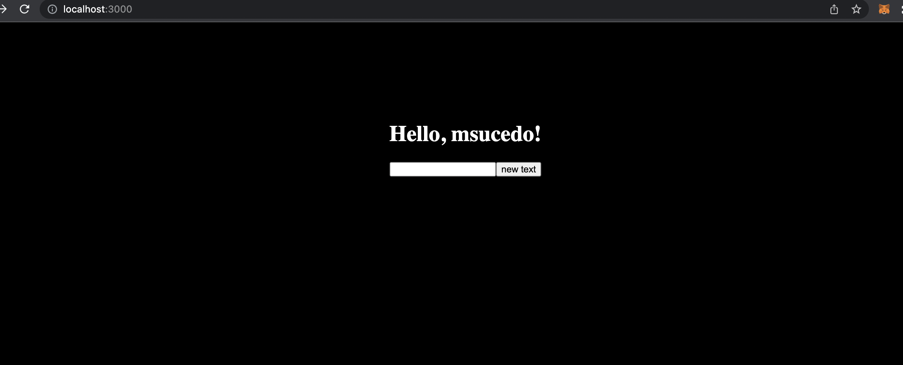
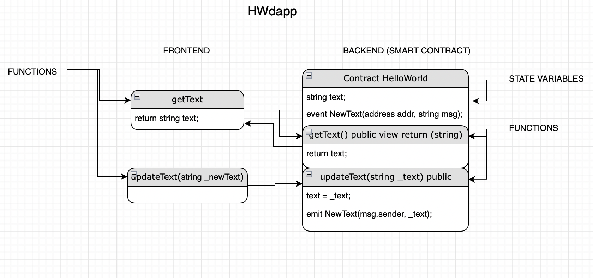
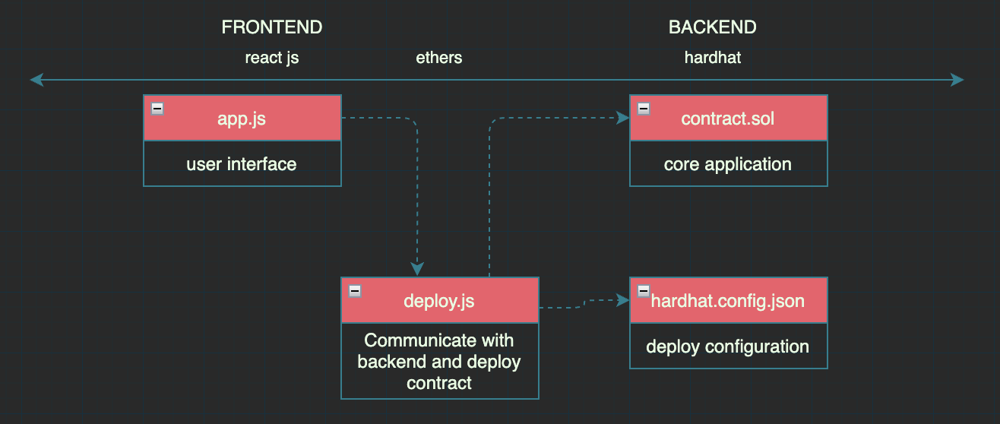

# Hello World DAPP

HWdapp is a hello world decentralized application. Contains the basic functionality so you can use it as a template and start building your own application.

Think of it as a hello world dapp starter kit.

## Table of contents
  * [What the dapp does?](#what-the-dapp-does-)
  * [Architecture diagram](#architecture-diagram)
  * [Technologies stack](#technologies-stack)
  * [Prerequisites](#prerequisites)
  * [Installation](#installation)
  * [Usage](#usage)
  * [Disclaimer](#disclaimer)
  * [FAQ](#faq)
  * [Other helpful resources](#other-helpful-resources)
  * [License](#license)

## What the dapp does?



- show text stored in the blockchain, and update that text. interact directly with ethereum blockchain!!

- Everytime you update `HelloWorld` contract, ethers automatically will point to the new deployed address.

## Basic architecture diagram



## Technologies stack
> - react - build front end, animations, make your app look cute
> - ethers - Communicate with the blockchain and bridge to frontend
> - hardhat - compile, test and create a local blockchain


###### each red box represents the main file name from each technology


## Prerequisites

1. node js and yarn
2. metamask account -> [https://metamask.io](url)
3. an alchemy.com account -> [https://www.alchemy.com](url) (only if you want to deploy to testnet)
4. fake ether from the testnet you want to use  -> [https://faucet.rinkeby.io](url) (only if you want to deploy to testnet)

## Installation

1. Clone repository
```bash
git clone https://github.com/msucedo/HWdapp.git
``` 

2. Install dependencies
```bash
cd HWdapp
yarn install
```

## Usage

#### Compile contract

```bash
cd HWdapp
yarn compile
```

#### Deployment quick start!
```bash
cd HWdapp
> yarn chain 		// deploy local blockchain
> yarn deploy 		// deploy contract - run this everytime you update the contract
> yarn start 		// start server at http://localhost:3000/
```
> ###### please copy any account from the `yarn chain` output and add it to metamask, we will use our localhost 8545 network. how to? -> [add hardhat account to metamask](https://dev.to/dabit3/the-complete-guide-to-full-stack-ethereum-development-3j13)
> ###### note: you need three separate terminal windows
> ###### make sure metamask is running on localhost:8545!


#### deploy on testnet (i.e. rinkeby)
1. go to `HWdapp/hardhat-zone/secret.json`
2. add your alchemy.com api url and your metamask account private key
3. go to `HWdapp/hardhat.zone/hardhat.config.js`
4. update 'defaultNetwork' with your testnet name i.e. rinkeby
5. remove last comment inside "networks" to enable testnet settings
6. go to `HWdapp/react-zone/src/App.js`
7. uncomment 'chainId' for testnet and comment for localhost
7. deploy contract
```bash
cd HWdapp
yarn deploy
```	
###### note: copy the contract address from your terminal window, open etherscan.io for your selected testnet and search the address. you should be able to see your contract.


## Disclaimer
sadly you might find bugs, but for the simplicity and goal of the exercise they don't represent a risk, take this code as what it is (a path to the needed tools, folders, configurations to build, test and deploy locally a dapp).

Please note the goal of this repository is to give a clearer path of (one in between many choices you have on) how to locally build dapps, I found myself having trouble to understand how to develop locally and now that I have a kinda better idea I wanted to share with anyone interested the tools that I used and make available this simple template.

- note1: these are not the only tools available to build and deploy dapps.
- note2: regarding the alchemy.com account, it is free, from there we just need to create an app and copy the application key
- note3: I did not talk about some steps as they are easily self explanatory (funding your metamask with fake ether, create an alchemy account, etc)
- note4: any questions, comments, suggestions feel free to ping me at discord @msaucedo#2231


## FAQ

- Where can I edit the smart contract and the frontend?
> #### edit contract - HWdapp/hardhat-zone/contracts/HelloWorld.sol
> #### edit frontend - HWdapp/react-zone/src/App.js

- why the next text in the DAPP is not changing?
> probably because common metamask error: "Nonce to high".
> Solution: metamask>accounts>settings>advanced>reset account
more on this here [nonce to high error](https://medium.com/@thelasthash/solved-nonce-too-high-error-with-metamask-and-hardhat-adc66f092cd)
 

- I'm having issues compiling and running the project, what should I do?
> if no luck by yourself, ping me @msaucedo#2231 at discord.

- What if I want to make a change to the contract?
> 1. update contract at "HWdapp/hardhat-zone/contracts/HelloWorld.sol"
> 2. make sure your node and frontend server are up (`yarn chain` & `yarn start`)
> 3. run `yarn deploy`


- I'm seeing error:
```javascript
Error: call revert exception (method="getText()", errorArgs=null, errorName=null, errorSignature=null, reason=null, code=CALL_EXCEPTION, 
version=abi/5.5.0)
    at Logger.makeError (index.ts:225:1)
    at Logger.throwError (index.ts:237:1)
    at Interface.decodeFunctionResult (interface.ts:425:1)
    at Contract.<anonymous> (index.ts:392:1)
    at Generator.next (<anonymous>)
    at fulfilled (index.ts:1:1)

```
> you need to import a local hardhat account to metamask and use local network 8545. how to? -> [add hardhat account to metamask](https://dev.to/dabit3/the-complete-guide-to-full-stack-ethereum-development-3j13)

## Other helpful resources
- [buildspace.so](https://buildspace.so)
- [eth.build](https://eth.build) - omg this is pure gold
- [scaffold-eth](https://github.com/scaffold-eth/scaffold-eth) - if you mastered HWdapp take a look here!!!
- [cryptozombies](https://cryptozombies.io)
- [full stack Ethereum guide](https://dev.to/dabit3/the-complete-guide-to-full-stack-ethereum-development-3j13)

## License
[MIT](https://choosealicense.com/licenses/mit/)
